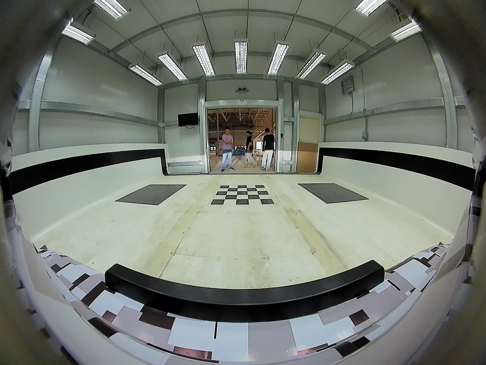
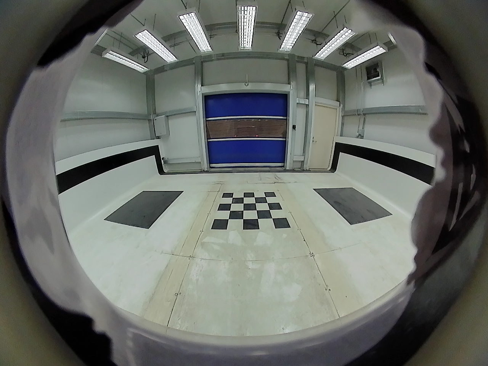
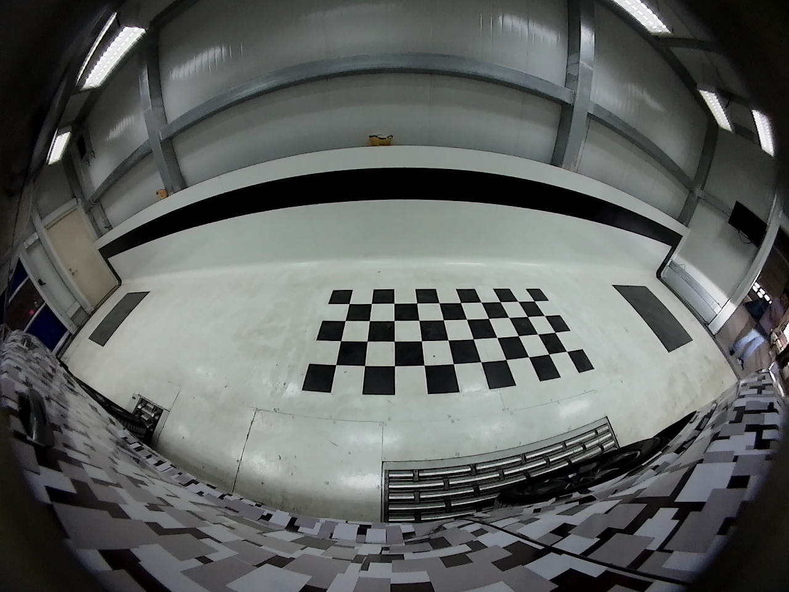
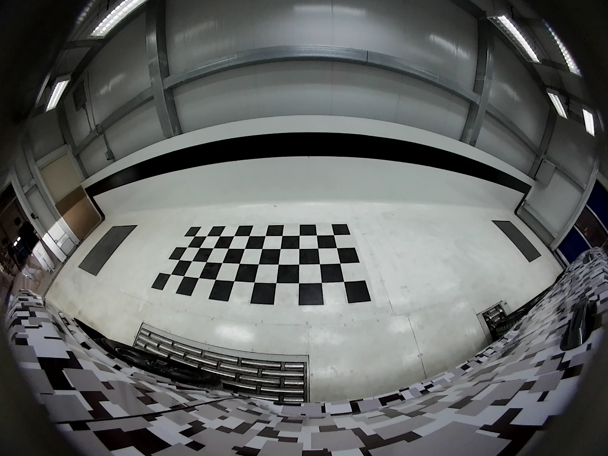
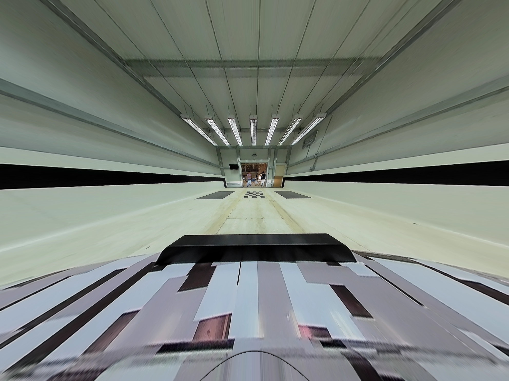
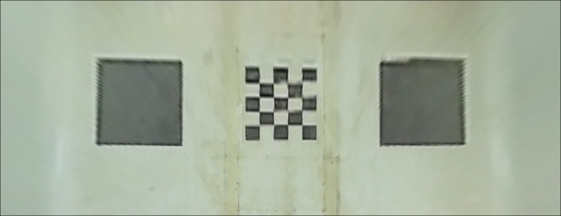
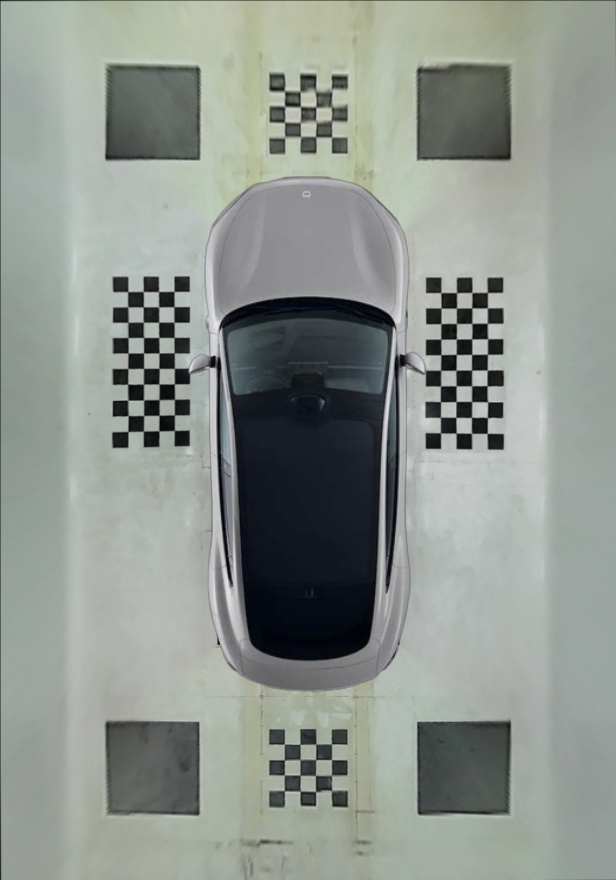

> [!TIP]
> 欢迎加入“Xget 开源与 AI 交流群”，一起交流开源项目、AI 应用、工程实践、效率工具和独立开发；如果你也在做产品、写代码、折腾项目或者对开源和 AI 感兴趣，欢迎[**进群**](https://file.xi-xu.me/QR%20Codes/%E7%BE%A4%E4%BA%8C%E7%BB%B4%E7%A0%81.png)认识更多认真做事、乐于分享的朋友。

# AVM - Around View Monitoring System

An OpenCV-based 360-degree surround view system that processes fisheye camera images to create a bird's eye view for vehicle parking assistance and navigation.

## 🚀 Features

- **Multi-Camera Fisheye Processing**: Supports 4 fisheye cameras (front, back, left, right)
- **Automatic Corner Detection**: Uses advanced histogram-based algorithms for calibration board detection
- **Real-time Undistortion**: Efficient fisheye-to-rectilinear image transformation
- **Perspective Transformation**: Converts undistorted images to bird's eye view
- **Seamless Stitching**: Blends multiple camera views into a single panoramic image
- **Vehicle Overlay**: Adds vehicle model overlay for spatial reference

## 🛠️ Installation

### Prerequisites

- **OpenCV 3.0+** (4.x recommended)
- **CMake 3.10+**
- **GCC/Clang** with C++11 support
- **Linux/macOS/Windows** (WSL2 recommended for Windows)

### Quick Installation

```bash
# Clone the repository
git clone https://github.com/xixu-me/AVM.git
cd AVM

# Make scripts executable
chmod +x scripts/*.sh

# Build the project
./scripts/build.sh
```

For detailed installation instructions, see [INSTALLATION.md](docs/INSTALLATION.md).

## 🚀 Quick Start

### Run with Sample Data

```bash
# Execute the AVM system with provided sample images
./scripts/run.sh
```

### Expected Output

After successful execution, you'll find the following files in the `build/` directory:

- `stitched_result_with_su7.jpg` - Final 360° panoramic view
- `bird_*.jpg` - Individual bird's eye view images
- `*_undis.jpg` - Undistorted fisheye images

## 📸 Input Images

The AVM system processes four fisheye camera images positioned around the vehicle:

### Camera Configuration

| Camera Position | File | Description |
|----------------|------|-------------|
| **Front** | `assets/images/front.png` | Front bumper center, covers front area |
| **Back** | `assets/images/back.png` | Rear bumper center, covers rear area |
| **Left** | `assets/images/left.png` | Left side mirror, covers left side |
| **Right** | `assets/images/right.png` | Right side mirror, covers right side |

### Sample Input Images

<div align="center">

| Front Camera | Back Camera |
|:------------:|:-----------:|
|  |  |
| *Front fisheye camera capturing forward area* | *Rear fisheye camera capturing backward area* |

| Left Camera | Right Camera |
|:-----------:|:------------:|
|  |  |
| *Left side fisheye camera* | *Right side fisheye camera* |

</div>

### Input Image Specifications

- **Resolution**: 1280×960 pixels
- **Format**: PNG/JPG
- **Camera Type**: Fisheye lens with wide FOV
- **Calibration**: 2×4 rectangular grid pattern visible in each image
- **Bit Depth**: 8-bit RGB

### Calibration Board Requirements

Each input image must contain a **2×4 rectangular calibration pattern**:

- **Grid Size**: 2 rows × 4 columns (8 corners total)
- **Visibility**: Pattern must be clearly visible in overlapping areas
- **Contrast**: High contrast between pattern and ground
- **Position**: Within the valid detection region (20%-70% of image height)

## 🎯 Output Images

The AVM system generates multiple intermediate and final output images:

### Processing Pipeline Outputs

<div align="center">

| Stage | Description | Example |
|-------|-------------|---------|
| **1. Undistorted Images** | Fisheye correction applied |  |
| **2. Bird's Eye View** | Perspective transformation |  |
| **3. Final Stitched Result** | Complete 360° view |  |

</div>

### Final Output Visualization

The final stitched image provides a complete 360-degree around view:

<div align="center">

<p><em>Complete 360° Around View Monitor output with vehicle overlay</em></p>
</div>

### Output Image Details

#### 1. Undistorted Images (`*_undis.jpg`)

- **Purpose**: Corrected fisheye distortion
- **Resolution**: 1280×960 pixels
- **Features**: Corner points marked, distortion removed

#### 2. Bird's Eye View Images (`bird_*.jpg`)

- **Front/Back Views**: 792×305 pixels
- **Left/Right Views**: 1131×281 pixels
- **Perspective**: Top-down view transformation
- **Rotation**: Automatically corrected for proper orientation

#### 3. Debug Images

- **Contrast Enhanced** (`*_img_contrast.jpg`): Gamma-corrected for corner detection
- **Thresholded** (`*_img_thresh.jpg`): Binary images showing detected features
- **Corner Detection** (`*_undis_1.jpg`): Undistorted images with detected corners marked

#### 4. Final Stitched Image (`stitched_result_with_su7.jpg`)

- **Composition**: All four camera views seamlessly blended
- **Vehicle Overlay**: Su7 vehicle model positioned at center
- **Dimensions**: Variable based on camera layout
- **Blending**: Smooth transitions using mask images

## 🏗️ System Architecture

### Processing Pipeline

```
[Fisheye Images] → [Undistortion] → [Corner Detection] → [Bird's Eye Transform] → [Image Stitching] → [Final Output]
```

### Key Components

1. **Undistortion Engine**: Converts fisheye to rectilinear projection
2. **Corner Detector**: Histogram-based calibration pattern detection
3. **Perspective Transform**: Homography-based bird's eye view generation  
4. **Image Stitcher**: Mask-based seamless image blending

### Camera Model

The system uses a polynomial fisheye distortion model:

```
θ_distorted = θ_undistorted + k₁θ³ + k₂θ⁵ + k₃θ⁷ + k₄θ⁹
```

Default parameters optimized for automotive fisheye cameras.

## ⚙️ Configuration

### Camera Parameters

Key parameters that can be adjusted in `src/avm.cpp`:

```cpp
// Camera intrinsics
float m_focal_length = 910.0;      // Camera focal length (pixels)
float m_fish_scale = 0.5;          // Fisheye scaling factor
float m_undis_scale = 1.55;        // Undistortion scaling

// Distortion coefficients
cv::Vec4d distortion_coeffs = {
    -0.05611147,  // k1
    -0.05377447,  // k2
     0.0115717,   // k3
     0.0030788    // k4
};
```

### Layout Configuration

```cpp
#define IMAGE_BACK_PIXEL_Y 643   // Back image Y offset
#define IMAGE_RIGHT_PIXEL_X 398  // Right image X offset
```

### Using Custom Images

1. **Replace Input Images**: Place your fisheye images in `assets/images/`
2. **Name Convention**: Use `front.png`, `back.png`, `left.png`, `right.png`
3. **Calibration Pattern**: Ensure 2×4 grid is visible in overlapping areas
4. **Adjust Parameters**: Modify camera parameters if using different lenses

## 🔧 Troubleshooting

### Common Issues

#### Build Errors

```bash
# OpenCV not found
sudo apt-get install libopencv-dev libopencv-contrib-dev

# CMake version too old
wget https://cmake.org/files/v3.20/cmake-3.20.0-linux-x86_64.sh
```

#### Runtime Issues

```bash
# Missing input images
cp your_images/* assets/images/

# Permission denied
chmod +x scripts/*.sh
```

#### Corner Detection Failures

- Ensure calibration board has high contrast
- Check that pattern is within valid detection region
- Verify image quality and lighting conditions

### Debug Mode

Enable debug output by modifying the source code:

```cpp
#define DEBUG_MODE 1  // Add this line for debug output
```

## 📊 Performance

### Typical Processing Times

- **Image Loading**: ~10ms per image
- **Undistortion**: ~50ms per image  
- **Corner Detection**: ~100-200ms per image
- **Stitching**: ~100ms total
- **Overall**: ~1-2 seconds for complete pipeline

### Memory Usage

- **Peak Memory**: ~30-40MB
- **Input Images**: ~5MB total
- **Intermediate Results**: ~20MB
- **Output Images**: ~2-3MB

## 📄 License

This project is licensed under the MIT License - see the [LICENSE](LICENSE) file for details.

## 🙏 Acknowledgments

- OpenCV community for excellent computer vision library
- Contributors to fisheye camera calibration algorithms
- Automotive industry standards for AVM system requirements

## 📞 Support

- **Documentation**: Check [docs/](docs/) directory for detailed guides

---

<div align="center">
<p>Made with ❤️ for safer driving</p>
<p>⭐ Star this repo if you find it helpful!</p>
</div>
